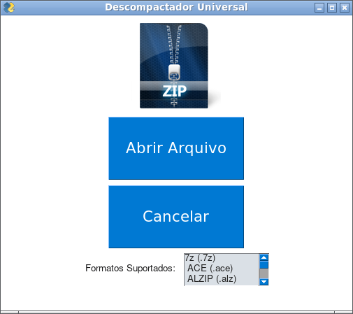

# Descompactador de Arquivos

**Descompactador de Arquivos** é um descompactador universal, capaz de descompactar os principais tipos de arquivos compactados atualmente, entre eles: RAR, ZIP, TAR, [entre outros](formatos.txt)...

**Descompactador de Arquivos** foi escrito inteiramente em python, possui interface gráfica graças ao [pysimplegui](https://pypi.org/project/PySimpleGUI/) e é muito fácil de usar.

## Instalação e dependências:

Para usar o **Descompactador de Arquivos Universal**, você precisará ter o [python](https://python.org) e o [GIT](https://git-scm.com/download/) em seu computador.

Você também precisará ter habilidade para utilizar o sistema operacinal.

Utilize o terminal/prompt de comandos para clonar esse repositório e preparar o VENV ([saiba mais](https://docs.python.org/pt-br/3/library/venv.html)).

### Instalação no LINUX/MAC OS

~~~
git clone https://github.com/elizeubarbosaabreu/Descompactador-de-Arquivo/
cd Descompactador-de-Arquivo/
python3 -m venv .venv
source .venv/bin/activate
pip install -r requirements.txt
python main.py 
~~~

### Instalação no Windows

~~~
git clone https://github.com/elizeubarbosaabreu/Descompactador-de-Arquivo/
cd Descompactador-de-Arquivo/
python -m venv .venv
source .venv\Scripts\activate.bat
pip install -r requirements.txt
python main.py 
~~~

### Como Usar O  Descompactador de Arquivos Universal

No linux dá para usar um link que aponta para o executável python dentro da pasta *.venv/bin* seguido do path do arquivo *main.py*. Isso é possível através do Alacarte.

Exemplo: 

~~~
path/Descompactador-de-Arquivo/.venv/bin/python3 'path/Descompactador-de-Arquivo/Descompactador-de-Arquivo/main.py'
~~~

Onde o trecho **path** deve ser substituído pelo caminho onde o arquivo está. Isso varia pois depende de onde você salvou o arquivo.

Outra opção (válida para todos os Sistemas Operacionais) é converter o código fonte python em executável utilizando o [pyinstaller](https://pypi.org/project/pyinstaller/).

### Obrigado!!!

